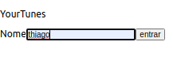
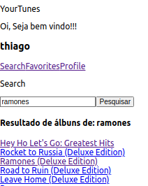

# Boas vindas ao repositório do projeto YourTune!

Esta projeto simula uma aplicação para ouvir musicas de bandas usando uma API externa para ter acesso ao banco de dados.

Infelizmente, Algumas bandas como U2, red hot chilli peppers não constam na API.também cada musica só roda uma demo de 29 segundos para proteger o direito autoral dos artistas. 

Esta aplicação foi construida com React e abre na porta 3000 no endereço http://localhost:3000/, as informações são salvas no local storage do seu browser, sendo apagadas quando fecha o seu browser de navegação.

Então Digite seu nome, procure por uma banda, escolha sua musica favorita e favorite, irá encontra-la na aba Favorites! que tal procurar por <strong>Ramones</strong>, <strong>Scorpions</strong> e <strong>Queen</strong>!!!

A aplicação inicia com a <strong>tela de Login</strong>, na qual você digita o seu nome de usuário.

Search para procurar uma banda!!!

Escolha uma musica e favorite para ele estar na aba "Favorites"

# ‼️ instalando este projeto !!

  1. Clone o repositório
  - entre na pasta que deseja instalar e abra o terminal.
  - Use o comando: `git clone git@github.com:th-maia/YourTunes.git`.
  - Entre na pasta do repositório que você acabou de clonar:
    - `cd YourTunes`

  2. Instale as dependências

  - Para isso, use o seguinte comando: `npm install`, espere alguns segundos.
      caso dê algum erro tente rodar novamente o comando acima, pode ocorrer por diferentes versões ou pacotes que foram instalados após outros.
  
  3. rode o comando para iniciar a aplicação: `npm start`
      este comando demora alguns segundos, se tudo der certo irá aparecer a pagina web. 

